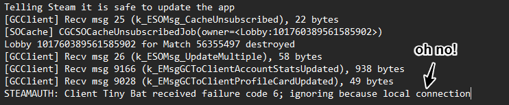

# Deadlock-Disconnect-Issue-1

This project is a personal project aimed at trying to find and solve issues looking at the steam console with intention of helping other users who may be having the specific issues that I am having.

As of 2/7/26, I have been unable to connect and stay connected to games, being disconnected at random intervals and not able to understand why this specific issue is happening. There will be pictures to show examples of codes that I am getting and errors that I am getting as I explain things.

### Issue Solved/Explained! (I Think will test for a few days and try to replicate)

While having some fun little issues I discoverd 3 error codes that were happening:

`STEAMAUTH: Client "Username" received failure code 6`
also
`STEAMAUTH: Client "Username" received failure code 6; ignoring because local connection`

and
`[SteamNetSockets] [#3126470666 SDR server steamid:9########... vport 0 'server'] closed by peer (2009): NETWORK_DISCONNECT_STEAM_LOGON`

after some thinking and build set up I realized something critical:

- I have a 2 pc set-up
- Both pcs had my steam account logged in
- There have been additional cloud issues before

Knowing that I was successfully logged into my account on 2 pcs that have had cloud errors due to both account being updated differently, I knew that there was something relavant with steam crashing.

This shouldn't have been an issue because:
- I have played all other steam games just fine while logged into both.
- I've never had an issue doing this.
- This seems like something unfortunate and unlucky at best.

So my plan of action was to turn off the secondary pc and sign out of steam and log back in.

# Recommendataions If you're having a similar Issue

1. Log out of all other instances of your steam account.
2. Check to make sure you're not having any cloud errors.
3. Sign out of all instances of your steam account (including main pc).
4. Relog into steam and try the game again.